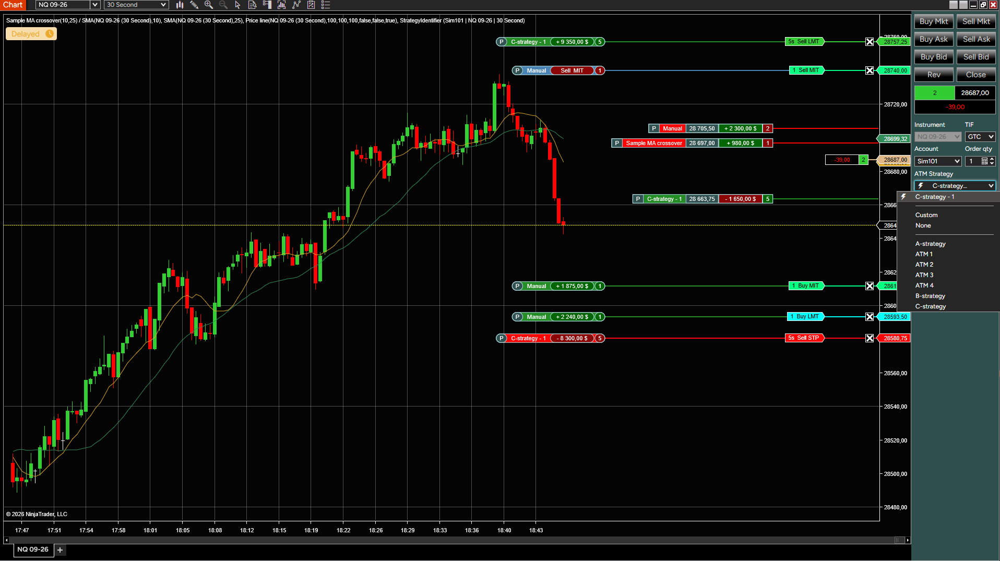
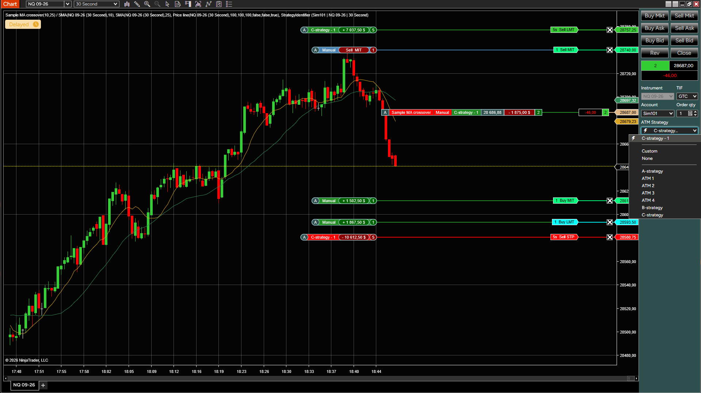
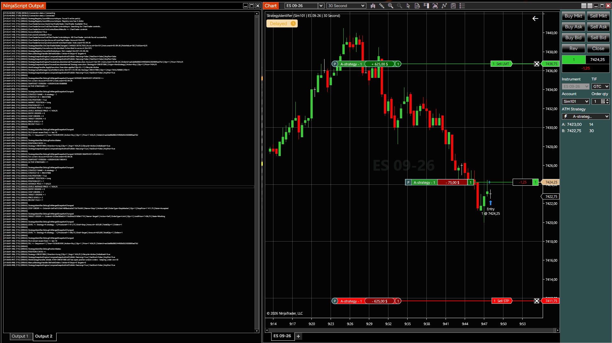

## StrategyIdentifier (NinjaTrader 8)

A NinjaTrader 8 indicator that overlays your **live strategy activity directly on the chart** — entries, stops, targets, and average price levels — for every strategy currently working on an account/instrument (Manual, ATM, or NinjaScript strategies).

It also plugs into the **ChartTrader** to stay in sync with whichever account/instrument you have selected.

This indicator is read-only with respect to trading operations: it does not submit, modify, or cancel orders. It reads and visualizes account, order, execution, and position state provided by NinjaTrader. Test thoroughly on a demo/sim account before relying on it in live trading.

## Images

**Personal mode** — each strategy (Manual, ATM, NinjaScript) shown separately with its own levels and P&L (`P` badge):

**Aggregated mode** — strategies sharing the same account/instrument combined into one view (`A` badge):

**Debug logging** — full merged strategy snapshot dumped to the NinjaScript Output window when `EnableDebugLogging` is enabled:

## What it does

- Draws horizontal price levels for **entry**, **stop**, and **target** orders belonging to active strategies
- Draws an **average price marker** per strategy (or per aggregated position)
- Two calculation modes:
  - **Personal** — each strategy shown separately
  - **Aggregated** — combined across strategies sharing the same account/instrument
- Reconciles order/position/execution data from three strategy origins: **Manual**, **ATM**, and **NinjaScript** strategies, and correctly re-attributes orders when a strategy is closed, stopped, or handed off to manual management
- Syncs automatically with the **ChartTrader** account/instrument selectors
- Optional debug logging of the full merged strategy snapshot and position states to the NinjaTrader Output window

## Best use

- Keeping track of multiple concurrent strategies (manual + automated) on the same chart without losing track of which order belongs to which strategy
- Visually auditing that ATM/NinjaScript strategy orders match what you expect while trading live
- Aggregated view for accounts running several strategies on the same instrument, to see net exposure at a glance

## Parameters

**Strategy Mode**
- **StrategyMode**: `Personal` or `Aggregated`

**Display Markers**
- **ShowStratAvgPriceMarker**: show the average price marker per strategy
- **ShowAvgPrice**: show the average price value on the marker
- **ShowUnPnl**: show unrealized P&L on the marker
- **AddOrderMarkerOffset / AddAverageMarkerOffset**: pixel offset tweaks for marker placement
- **HorizontalLineWidth**: thickness of level lines
- **IsBoldText**: bold marker text

**Brush Settings**
- Separate brushes for text, border, marker background, up/down amount background, entry/target/stop background, and up/down quantity background

**NinjaScript Order Names**
- **NsStopSignalNames / NsTargetSignalNames**: comma-configurable signal names so the indicator recognizes your custom NinjaScript strategy order names as stops/targets

**Logging Settings**
- **EnableDebugLogging**: verbose debug output (merged snapshot + position states) to the Output window
- **LogOutputTab**: which Output window tab to write to
- **IClearOutputWindow**: clear the Output window on indicator (re)load

## Installation

### Recommended: import via ZIP

1. Download the release ZIP.
2. Open NinjaTrader 8.
3. Go to **Control Center → Tools → Import → NinjaScript Add-On...**
4. Select the ZIP file and import.
5. If prompted, allow NinjaTrader to compile.
6. Open a chart → right-click → **Indicators** → add **StrategyIdentifier**.

## Developer / manual source install

The project is split into an **Indicator** and a set of **AddOn** support files, so file placement matters if you're pasting source directly instead of importing a ZIP:

| File | Goes in | Role |
|---|---|---|
| `StrategyIdentifier.cs` | `Indicators` | Main indicator: chart lifecycle, rendering, mouse handling, user-facing settings |
| `StrategySnapshotManager.cs` | `AddOns` | Core domain engine: strategy models, order/position/fill stores, reconciliation between Manual/ATM/NinjaScript strategies, per-account/instrument registry |
| `ChartTraderService.cs` | `AddOns` | Finds and syncs with the ChartTrader panel's account/instrument selectors |
| `NearestStrategyData.cs` | `AddOns` | Resolves the nearest strategy price level to a hover/click point on the chart |
| `RenderHelpers.cs` | `AddOns` | SharpDX/Direct2D rendering helpers: brush caching, text layout caching, marker segment drawing |
| `NtNullLogger.cs` | `AddOns` | Logging abstraction (`IStrategyLogger`) with a null-object default |
| `UiThreadHelper.cs` | `AddOns` | Dispatcher helpers for safely invoking/posting to the UI thread |
| `DebugSnapshotState.cs` | `AddOns` | Verbose debug dump of the merged snapshot / position states, gated by `EnableDebugLogging` |

Steps:

1. Open NinjaTrader 8 → **New → NinjaScript Editor**.
2. In the Project tree, add each `AddOns`-column file under **Add-Ons** (right-click **Add-Ons → Add New Item** with a matching name).
3. Add `StrategyIdentifier.cs` under **Indicators**.
4. Press **F5** (Compile).
5. Add the indicator to a chart via **Indicators**.

> All non-indicator files live under the shared namespace root `NinjaTrader.NinjaScript.AddOns.AddOnsStrategyIdentifier.*` — do not change the namespace declarations, NinjaTrader relies on them.

## Notes

- The cold start of the indicator (the very first indicator installed in the platform) is performed on a clean chart without strategies, open positions and orders.
- Works with or without the ChartTrader panel visible; falls back to detecting the connected account/instrument directly from the chart when ChartTrader isn't available.
- If you use NinjaScript strategies with custom stop/target order names, set them under **NS Stop Names / NS Target Names** so the indicator can label them correctly.

## Status & Testing

The indicator has been tested on NinjaTrader Version 8.1.4.2 and higher
The indicator has been exercised in live-market, real-time operation for approximately 3 months across normal discretionary and automated trading workflows, including Manual, ATM, and NinjaScript strategy activity, without any known reproducible failures observed during that period.

That said, there is currently **no automated unit test suite**.

**Contributions, code review, and test coverage are welcome** — especially around `StrategySnapshotManager.cs`'s reconciliation and attribution logic. If you find a discrepancy between what the indicator shows and your actual account state, please open an issue with (if possible) `EnableDebugLogging` output covering the relevant sequence of orders/fills.

## Troubleshooting

- **No levels appear**: confirm the account is fully flat when the indicator loads, and that ChartTrader (or the chart's own instrument/account) resolves to a valid, connected account.
- **A strategy's levels look wrong after a partial close or strategy handoff**: enable `EnableDebugLogging` and check the Output window for the merged snapshot dump; please include this when reporting an issue.
- **Custom NinjaScript stop/target orders aren't recognized**: check that `NsStopSignalNames` / `NsTargetSignalNames` match the signal names used by your strategy.
- **Performance**: rendering uses cached Direct2D brushes and text layouts; if you still notice chart lag, try disabling `EnableDebugLogging` (verbose logging is not free).

## Disclaimer

This software is provided for informational/educational purposes and comes with **no warranty of any kind**. Trading involves risk of loss. You are solely responsible for verifying that displayed strategy/order/position information matches your broker/account before making trading decisions.

The Software is provided for informational and analytical purposes only and does not constitute investment advice, trading advice, or a recommendation to buy or sell any financial instrument.

## Licensing Summary

This project is available under the PolyForm Noncommercial License 1.0.0. In general, the project may be used for personal, educational, research, and other non-commercial purposes. See LICENSE for the authoritative legal terms.

You may:

- use the indicator on your own NinjaTrader installation;
- modify the source code for your own use;
- share improvements and bug fixes with the project.

You may not:

- sell the software or derivative versions;
- include it in a paid product, signal service, or subscription;
- redistribute it as part of a commercial offering.

Commercial licenses are available from the author.

## License

Licensed under the **[PolyForm Noncommercial License 1.0.0](https://polyformproject.org/licenses/noncommercial/1.0.0)** — see [LICENSE](LICENSE) for the full legal text. The summary above is provided for convenience only; in case of any conflict, the text in `LICENSE` governs.
